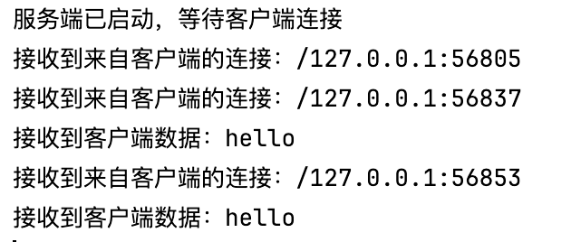

## 双端通信

> Socket的原理这里不再赘述，记录两段详细的服务端/客户端代码

Server.java

```java
package mobai;

import java.io.IOException;
import java.io.InputStream;
import java.io.OutputStream;
import java.net.ServerSocket;
import java.net.Socket;

public class Server {
  public static void main(String[] args) throws IOException {
    try (ServerSocket server = new ServerSocket(8080)) {
      Socket socket = server.accept();
      System.out.println("接收到来自客户端的连接：" + socket.getInetAddress() + ":" + socket.getPort());
      InputStream in = socket.getInputStream();
      OutputStream out = socket.getOutputStream();
      int len;
      byte[] bytes = new byte[1024];
      while ((len = in.read(bytes)) > 0) {
        System.out.println("接收到客户端数据：" + new String(bytes, 0, len));
        out.write(("服务端已收到长度为" + len + "字节的数据").getBytes());
      }
    } catch (IOException e) {
      e.printStackTrace();
    }
  }
}
```

Cilent.java

```java
package mobai;

import java.io.IOException;
import java.io.InputStream;
import java.io.OutputStream;
import java.net.Socket;
import java.util.Scanner;

public class Cilent {
  public static void main(String[] args) {
    try (Socket sock = new Socket("localhost", 8080)) {
      Scanner scanner = new Scanner(System.in);
      System.out.println("客户端已启动，已连接到服务端");
      InputStream in = sock.getInputStream();
      OutputStream out = sock.getOutputStream();
      // 创建socket的输入输出获取流
      while (true) {
        System.out.print("请输入你想要输入的信息：");
        String msg = scanner.nextLine();
        if(msg.equals("exit")) {
          break;
        }
        out.write(msg.getBytes());
        // 将输入的信息转换为字节流
        int len;
        byte[] buffer = new byte[1024];
        len = in.read(buffer);  // 获取服务端返回的信息，存入到buffer数组中，下面则是打印出来
        System.out.println(new String(buffer, 0, len));
        // 客户端将服务端返回的信息转换为字符串输出
      }
    } catch (IOException e) {
      e.printStackTrace();
    }
  }
}
```

> 其他文件信息也就大差不大了都是这样

## 多线程Socket

> 将Server的服务注册为线程，创建子线程完成即可

Server.java

```java
package mobai;

import java.io.IOException;
import java.io.InputStream;
import java.io.OutputStream;
import java.net.ServerSocket;
import java.net.Socket;

public class Server {
  public static void main(String[] args) throws IOException {
    System.out.println("服务端已启动，等待客户端连接");
    try (ServerSocket server = new ServerSocket(8080)) {
      while (true) {
        Socket socket = server.accept();
        System.out.println("接收到来自客户端的连接：" + socket.getInetAddress() + ":" + socket.getPort());
        new Handler(socket).start();
        // 创建一个线程对象，将socket传入并启动线程
      }
    } catch (IOException e) {
      e.printStackTrace();
    }
  }
}

class Handler extends Thread {
  private Socket socket;

  public Handler(Socket socket) {
    this.socket = socket;
  }

  // 创建Thread对象，重写run方法
  @Override
  public void run() {
    try {
      solve(socket);
    } catch (IOException e) {
      e.printStackTrace();
    }
  }

  public void solve(Socket socket) throws IOException {
    InputStream in = socket.getInputStream();
    OutputStream out = socket.getOutputStream();
    int len;
    byte[] bytes = new byte[1024];
    while ((len = in.read(bytes)) > 0) {
      System.out.println("接收到客户端数据：" + new String(bytes, 0, len));
      out.write(("服务端已收到长度为" + len + "字节的数据").getBytes());
    }
  }
}
```

结果如下：



> 能够同时实现多个客户端向服务端的连接，具体的功能描述不做处理，需要的时候再处理即可
>
> 记忆下Thread的使用方式

补充说明：

```
关于Socket编程的数据传输流多为byte数组，字符串转byte或者byte转为字符串
```

