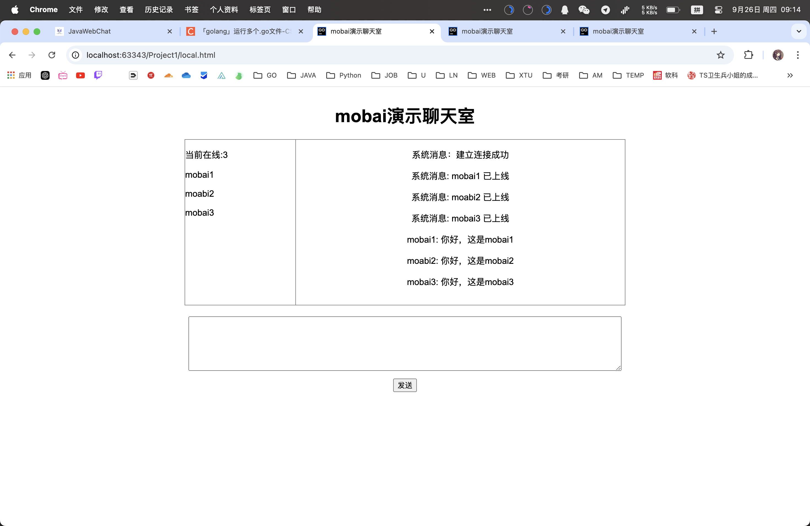

# JavaSocket

## Tutorial

### 介绍

该文件夹子简要介绍下JavaSocket的使用，关于最原始的搭建和使用JavaSocket的方式。

----

下面就是直接以项目练手了。

## JavaWebChat

### 介绍

该文件夹主要就是JavaSocket的实际应用，将其应用到JavaWeb项目项目中，也算是熟悉下如何搭建JavaWeb项目了。

> 基于JavaSocket通信的前后端分离的WebChat项目

### 前端

#### 样式

前端基于VueRoute的前端样式如下：

- 左侧显示当前在线的用户
- 右边上部显示聊天框：历史聊天记录之类的
- 下部显示输入框和发送按钮
- 框架设置完毕：输入框也可以放到下部，但是似乎缩放就没那么方便了

> 通过前后端交互实现将后端处理的数据展示到前台的以显示。

### 后端

不结合自己的前端可以得到这样的效果。

基于之前整理的Go项目

- 深入四个部件  -- 画个流程图吧
- Java代码转化

是否应该深入结合到数据库层面？？JDBC？ 或者直接用JavaSpringBoot将项目整合？
